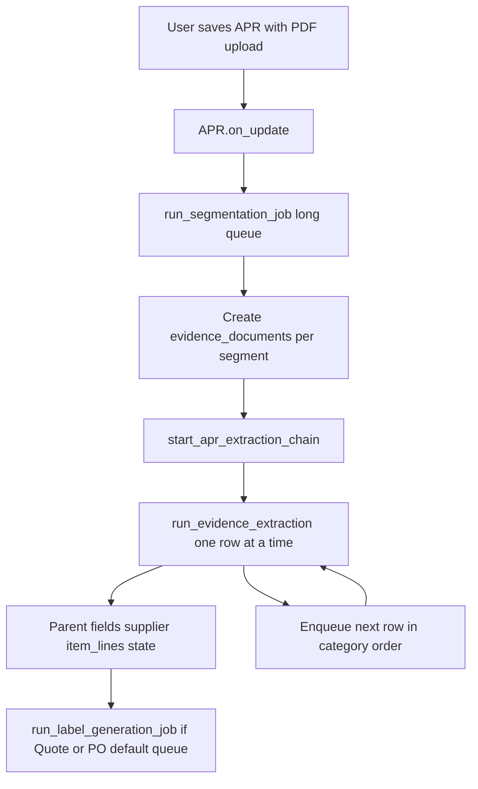
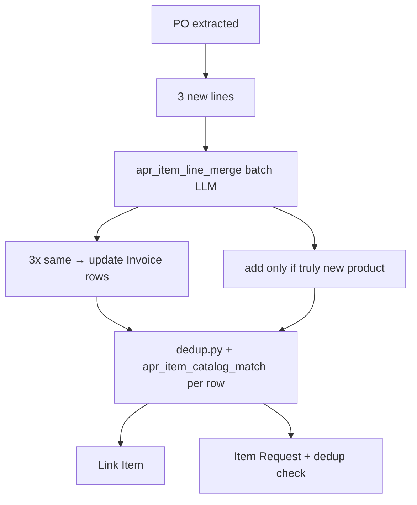

# Asset Organizer (`asset_organizer`)

A Frappe v15/v16 module inside `mpd_customizations` that tracks the full procurement lifecycle of fixed assets — from the first supplier quote through to commissioning — by attaching, classifying, and AI-extracting data from procurement documents (PDFs).

---

## Overview

When a capital asset is being purchased, dozens of documents are generated: quotes, purchase orders, tax invoices, gate passes, weighment slips, lorry receipts, e-Way bills, and payment advices. This module gives each asset a single **Asset Procurement Record (APR)** that collects all those documents, runs them through an LLM pipeline to extract structured data, and surfaces key milestones and financials automatically.

Consolidated **item lines** on the APR come only from **Purchase Orders** and **Invoices**. The system merges PO wording into existing Invoice rows (one row per physical product), then uses the shared Item Search index ([`mpd_base/item_ai/dedup.py`](../mpd_base/item_ai/dedup.py)) plus an LLM to link ERPNext **Items** or create **Item Requests**.

---

## Entry points

Everything starts from saving an **Asset Procurement Record**. Background work is queued on the **`long`** queue (segmentation, evidence extraction); label generation uses **`default`**.

| Entry point | Trigger | Module | What runs |
|---|---|---|---|
| **APR `on_update`** | User saves APR with new uploads or payments | [`asset_procurement_record.py`](doctype/asset_procurement_record/asset_procurement_record.py) | Enqueues `run_segmentation_job` per `uploaded_documents` row with `upload_status = Queued`; enqueues `run_payment_extraction` per payment with `extraction_status = Queued` |
| **APR `validate`** | Every save (UI or background) | Same controller | Recomputes `total_amount_paid` / `outstanding_balance`; updates `current_location` from location log; can set `record_status` to Asset Commissioned when installation gate passes |
| **`run_segmentation_job`** | Long-queue job from `on_update` | [`ai/apr_extraction.py`](ai/apr_extraction.py) | LLM segments multi-page PDF → splits pages → creates `evidence_documents` rows → enqueues `run_evidence_extraction` per segment |
| **`run_evidence_extraction`** | Long-queue job after segmentation (or requeue) | [`ai/apr_extraction.py`](ai/apr_extraction.py) | Classify + extract PDF → write evidence row → parent fields, supplier, **item lines**, state machine → optional label job |
| **`run_payment_extraction`** | Long-queue job from `on_update` | [`ai/apr_extraction.py`](ai/apr_extraction.py) | Extract payment fields into `APR Payment` child row |
| **`run_label_generation_job`** | Default queue after Quote/PO extract | [`ai/apr_extraction.py`](ai/apr_extraction.py) | Sets `asset_label` on APR from extracted item text |
| **`requeue_evidence_extraction`** | Whitelisted API | [`api/apr.py`](api/apr.py) | Re-runs `run_evidence_extraction` for one evidence row (out of band; does not use the ordered chain) |
| **`rerun_full_apr_extraction`** | Form button / list bulk | [`api/apr.py`](api/apr.py) | Full reset of evidence-derived data + re-segment all uploads + ordered evidence extraction |
| **`rerun_apr_payment_extraction`** | Form button / list bulk | [`api/apr.py`](api/apr.py) | Re-extract payment rows only (separate from evidence pipeline) |
| **`get_apr_summary`** | Whitelisted API / dashboard | [`api/apr.py`](api/apr.py) | Read-only summary for the APR form |

There is no direct HTTP API for item-line resolution; it runs inside `run_evidence_extraction` after each PO or Invoice is extracted.

### End-to-end flow (typical multi-page upload)



1. User attaches a PDF under **Uploaded Documents** (`Asset Documentation`, `upload_status = Queued`) and saves.
2. **`run_segmentation_job`** reads the PDF, calls `apr_document_segment`, splits into per-page PDFs, and appends **APR Evidence Document** rows (`extraction_status = Queued` → `Processing`).
3. When all pending segmentations for the batch finish, **`start_apr_extraction_chain`** runs evidence rows **one at a time** in category order (among types present): **Quote → PO → IGP → Weighment Slip → Invoice → others**.
4. Each **`run_evidence_extraction`** job:
   - Extracts fields with the category schema (`apr_extract_po`, `apr_extract_invoice`, etc.).
   - Runs **side effects** (see below).
   - Enqueues the next Queued evidence row on the same APR (chain).
5. If the document is Quote or PO, **`run_label_generation_job`** updates `asset_label` (PO produces the richer label).

Evidence rows can also be added manually; saving still goes through segmentation only for **uploaded_documents**, not for ad-hoc evidence rows.

---

## DocTypes

### `Asset Procurement Record` (APR) — primary document

| Section | Fields |
|---|---|
| Asset Details | `asset_description` (required), `record_status` (auto-managed), `ai_description_suggestion`, `asset_label` |
| Supplier | `supplier_doctype`, `supplier_link` (dynamic link), `supplier_gstin`, `supplier_name_raw` |
| Milestones | `quote_date`, `po_date`, `po_number`, `invoice_date`, `invoice_number`, `igp_date`, `igp_number` |
| Financials | `po_total_value`, `invoice_taxable_value`, `invoice_gst_amount`, `invoice_total_value`, `total_amount_paid`, `outstanding_balance` |
| Location | `current_location`, `final_location`, `installation_status`, `installation_date`, `erpnext_asset_link` |
| Child tables | `uploaded_documents`, `evidence_documents`, `item_lines`, `payments`, `location_log` |

**Naming:** `APR-.YYYY.-.#####`  
**Status flow (auto-managed):** Draft → Quotation Captured → PO Raised → Invoiced → Goods on Site → Payment Pending → Partially Paid → Fully Settled → Insurance Ready → Asset Commissioned

### `Asset Documentation` — uploaded PDF (child of APR)

| Field | Purpose |
|---|---|
| `upload_file` | Original multi-page PDF |
| `upload_status` | Queued → Processing → Segmented (or Failed) |
| `page_count` | Page count after segmentation |

### `APR Evidence Document` — one logical document (child of APR)

| Field | Purpose |
|---|---|
| `evidence_file` | Frappe Attach field (local or S3) |
| `detected_category` | Quote / PO / Invoice / IGP / Weighment Slip / Lorry Receipt / E-Way Bill / Payment / Other |
| `document_description` | Plain-English label from the LLM |
| `extracted_date` | Document date |
| `extracted_ref_no` | Reference number (PO number, invoice number, etc.) |
| `source_pages` | Page range from parent upload |
| `source_upload` | Link to `Asset Documentation` row |
| `extraction_status` | Queued → Processing → Extracted / Failed |
| `extracted_html_summary` / `extracted_json_vault` | Human and machine-readable extraction output |

### `APR Item Line` — consolidated procurement lines (child of APR)

Built from **PO** and **Invoice** extractions only (not Quote, IGP, or Other).

| Field | Purpose |
|---|---|
| `source_category` | `PO` or `Invoice` |
| `source_document_ref` | PO number or invoice number from extraction |
| `raw_description` | Description (Invoice wording preferred when PO is merged in) |
| `hsn_code` | HSN/SAC |
| `qty`, `uom`, `rate`, `line_total` | Quantity and money |
| `item_doctype` | `Item` or `Item Request` |
| `item_reference` | Dynamic link to catalog Item or Item Request name |
| `match_confidence` | `Exact Match` (LLM confirmed existing Item) or `No Match - Request Created` |

### `APR Payment`, `APR Location Log`, `Staged Supplier`

Unchanged from earlier design — payments extracted from bank advice PDFs; location log for commissioning gate; staged supplier when GSTIN is unknown in ERPNext.

---

## Item line resolution (`_resolve_item_lines`)

Called at the end of **`run_evidence_extraction`** when `detected_category` is **PO** or **Invoice**. Quote may still extract `item_lines` in JSON for totals/labels, but those lines are **not** appended to the APR.

### Design: two questions, two mechanisms

| Question | Mechanism | AI Task Config |
|---|---|---|
| Is this document line the **same row** as one already on this APR? (e.g. PO vs Invoice) | **One batched LLM call** per document | `apr_item_line_merge` |
| Does this line match an **existing ERPNext Item**? | **`dedup.py`** retrieval + **LLM** confirmation | `apr_item_catalog_match` |

`dedup.py` never auto-links by score alone. It returns up to five similar Items (TF-IDF + HSN in the index). The catalog LLM picks one candidate or declares a new product.

### Step 1 — Collect new lines

- Skip empty descriptions.
- **Idempotency:** skip if the same `(source_category, source_document_ref, raw_description)` already exists.

### Step 2 — Merge against existing APR lines (PO / Invoice only)

If other `item_lines` already exist on this APR (from a different source ref):

1. **LLM batch** — all new lines vs all existing lines (indexed `0..n` and `A..Z`), with qty, line total, HSN, and source in the prompt.
2. Response: `decisions[]` with `action: "same" | "add"`, `matched_existing_index`, `preferred_description`.
3. **Invoice preference:** when merging, keep Invoice `raw_description` and HSN over PO wording (e.g. `M.S. FLANGE ASA 150 25 MM` + full HSN, not `Ms Flange 1" R/F` + `7307`).
4. **`action: "same"`** — update the existing child row (fill blank uom/rate/hsn); do **not** append a new row.
5. **`action: "add"`** — append a new `APR Item Line`.
6. **Fallback:** if the merge LLM fails or returns invalid JSON, pair lines by **identical qty and line_total** (heuristic), then apply Invoice preference.

If there are no existing lines (e.g. first Invoice on the APR), every line is treated as `add`.

### Step 3 — Catalog link (each row that needs it)

For each new or merged row without an **Item** link:

1. **`check_item_duplicates(description, hsn_code=...)`** — [`dedup.py`](../mpd_base/item_ai/dedup.py) Redis TF-IDF index (includes item name, tally fields, legacy code, HSN).
2. **`apr_item_catalog_match` LLM** — line + candidate list → `is_existing_item` + `matched_item_code` (must be one of the candidates).
3. **If existing Item** — set `item_doctype = Item`, `item_reference`, `match_confidence = Exact Match`.
4. **If new product** — create **Item Request** from merged APR context:
   - `requester_description` is overwritten with a canonical merged PO+Invoice description
   - `combined_asset_description` stores the same canonical text (used by Item AI review + Item.description on creation)
   - `source_item_code` stores extracted lead code when present (e.g. `VCS00001`)
   - run **`check_item_duplicates_and_set_status`** so the Item Request UI shows similar Items (`Pending Dedup Check` or `Dedup Confirmed`).

Item Request review (“Generate AI Suggestion”) uses the same dedup index via [`review.py`](../mpd_base/item_ai/review.py), now preferring `combined_asset_description` and falling back to `requester_description`.

Serial/chassis/model extraction is not a dedicated step in this flow; the description quality comes from merged PO+Invoice line context plus normalized technical text.

### Example (same physical item, two wordings)

| Source | Description | Qty | Total | Result on APR |
|---|---|---|---|---|
| Invoice | M.S. FLANGE ASA 150 25 MM | 40 | 3600 | First row created |
| PO | Ms Flange 1" R/F | 40 | 3600 | Merged into same row (`same`); description stays Invoice |

Expected outcome: **3 rows** for three products, not six.



---

## AI extraction pipeline

### Evidence extraction side effects

After a successful extract in `run_evidence_extraction`, the pipeline runs in order:

| Step | Function | Applies to |
|---|---|---|
| Write milestone/financial header fields (blank-only) | `_write_parent_fields` | Quote, PO, Invoice, IGP, … |
| Resolve supplier (ERPNext or Staged Supplier) | `_resolve_supplier` | Documents with supplier GSTIN/name |
| **Resolve item lines** | `_resolve_item_lines` | **PO, Invoice only** |
| Update `record_status` | `_advance_state_machine` | All |
| Asset label (async) | `run_label_generation_job` | Quote, PO |

For PO extraction, the first extraction prompt includes the full `MPD Ujjain` location tree.
The LLM selects `main_location`, `level_1_location`, `level_2_location`, `level_3_location` directly from that tree and those values are written to:
- Evidence row fields: `main_location`, `level_1_location`, `level_2_location`, `level_3_location`
- Parent APR fields in **Location & Installation**: same fields, populated only when blank

These fields remain editable for manual corrections.

### LLM configuration (`AI Task Config`)

All LLM calls use `mpd_base` [`call_llm`](../mpd_base/item_ai/llm_call.py). Records are seeded by [`patches/seed_apr_ai_task_configs.py`](patches/seed_apr_ai_task_configs.py) and updated by [`patches/update_apr_item_ai_task_configs.py`](patches/update_apr_item_ai_task_configs.py).

| Task key | Purpose |
|---|---|
| `apr_document_segment` | Split multi-page upload into segments |
| `apr_extract_quote` | Quote extraction |
| `apr_extract_po` | PO extraction |
| `apr_extract_invoice` | Invoice extraction |
| `apr_extract_igp` | IGP extraction |
| `apr_extract_weighment` | Weighment slip |
| `apr_extract_lorry_receipt` | Lorry receipt |
| `apr_extract_eway_bill` | E-Way bill |
| `apr_extract_generic` | Other / fallback |
| `apr_extract_payment` | Payment advice |
| `apr_generate_label` | Short `asset_label` from Quote/PO items |
| **`apr_item_line_merge`** | **Batch: new PO/Invoice lines vs existing APR lines** |
| **`apr_item_catalog_match`** | **Confirm Item from dedup candidates or new product** |

### Pydantic schemas (`ai/schemas.py`)

Category-specific extraction schemas include optional `item_lines` arrays (`ItemLineSchema`: `raw_description`, `hsn_code`, `qty`, `uom`, `rate`). Only PO and Invoice item lines are persisted on the APR.

### File reading

- **Local** (`/private/files/`, `/files/`) — read from disk.
- **S3** (`frappe_s3_attachment`) — `S3Operations.read_file_from_s3()` in workers (no HTTP round-trip through the web server).

---

## API endpoints (`api/apr.py`)

| Method | Endpoint | Description |
|---|---|---|
| `GET` | `requeue_evidence_extraction(evidence_row_name)` | Re-enqueue a single evidence row (no ordered chain). System Manager or Stock Manager. |
| `GET` | `rerun_full_apr_extraction(apr_name)` | Reset evidence/item lines and document-derived APR fields; re-segment all uploads; ordered evidence extraction. **Does not touch payments.** |
| `GET` | `rerun_full_apr_extraction_bulk(apr_names)` | Same as above for multiple APRs (JSON list of names). |
| `GET` | `rerun_apr_payment_extraction(apr_name)` | Clear extracted payment fields and re-run `run_payment_extraction` for each payment row with a file. **Does not touch evidence.** |
| `GET` | `rerun_apr_payment_extraction_bulk(apr_names)` | Same as above for multiple APRs. |
| `GET` | `get_apr_summary(apr_name)` | Dashboard: status, financials, evidence counts, milestone checklist. |

### UI actions

| Location | Action | API |
|---|---|---|
| APR form → Actions | **Run Entire Extraction** | `rerun_full_apr_extraction` |
| APR form → Actions | **Re-extract Payments** | `rerun_apr_payment_extraction` |
| APR list → Actions menu (with rows selected) | **Run Entire Extraction** | `rerun_full_apr_extraction_bulk` |
| APR list → Actions menu | **Re-extract Payments** | `rerun_apr_payment_extraction_bulk` |

Callable from the APR form/list client script via `frappe.call`. Requires **System Manager** or **Stock Manager**.

### Extraction order (evidence)

After segmentation, available categories are processed in this priority (skipped if not present):

1. Quote  
2. PO  
3. IGP  
4. Weighment Slip  
5. Invoice  
6. Lorry Receipt, E-Way Bill, Payment (evidence), Other  

Ordering is enforced by an **APR-level job chain** (one `run_evidence_extraction` at a time per APR), so PO always completes before Invoice even when segments came from different uploaded PDFs.

---

## Background workers

| Queue | Jobs |
|---|---|
| **`long`** | `run_segmentation_job`, `run_evidence_extraction`, `run_payment_extraction` |
| **`default`** | `run_label_generation_job` |

The project `Procfile` includes a long-queue worker:

```
worker_long: bench worker --queue long
```

---

## Setup / installation

### 1. Migrate

```bash
bench --site <site> migrate
```

Runs DocType migrations and patches (including `seed_apr_ai_task_configs` and `update_apr_item_ai_task_configs`).

### 2. AI Task Configs

If item-line tasks are missing or prompts are stale:

```bash
bench --site <site> execute mpd_customizations.asset_organizer.patches.update_apr_item_ai_task_configs.execute
```

This upserts **`apr_item_line_merge`** (batch merge prompt) and ensures **`apr_item_catalog_match`** exists.

### 3. Item Search index

After `dedup.py` changes, rebuild the TF-IDF index from **Item Search Settings** in the desk, or:

```bash
bench --site <site> execute mpd_customizations.mpd_base.item_ai.dedup.rebuild_search_index
```

The index includes `item_name`, `custom_tally_name`, `custom_tally_alias`, `custom_legacy_code`, and `gst_hsn_code`.

### 4. Long-queue worker

```bash
bench worker --queue long
```

### 5. LLM provider

Configure **LLM Provider** and per-task **AI Task Config** (model, API key). Default seed uses OpenRouter + `gemini-3.1-flash-lite`.

### 6. Re-processing an existing APR

To fix item lines after code or config updates:

1. Run steps 2–3 above.
2. Clear duplicate `item_lines` on the APR if needed (keep one row per product).
3. Requeue PO and/or Invoice evidence rows via **requeue_evidence_extraction** (or set `extraction_status` to Queued and save if your UI supports it).

---

## Document category reference

| Category | Adds APR `item_lines`? | Key extracted fields |
|---|---|---|
| **Quote** | No (header/label only) | Supplier, date, total; may extract lines in JSON for label |
| **PO** | **Yes** | PO number, date, supplier GSTIN, item lines, total, resolved location hierarchy (`main_location`, `level_1/2/3_location`) |
| **Invoice** | **Yes** | Invoice number, date, taxable value, GST, item lines, total |
| **IGP** | No | IGP number, date, vehicle; may list items in JSON only |
| **Weighment Slip** | No | Weights, vehicle, material |
| **Lorry Receipt** | No | LR number, parties, freight |
| **E-Way Bill** | No | EWB, IRN, GSTINs, values |
| **Payment** | No (uses `payments` table) | Date, amount, UTR |
| **Other** | No | Generic key-value map |

---

## File structure

```
asset_organizer/
├── README.md
├── ai/
│   ├── apr_extraction.py      # Segmentation, evidence/payment extraction, item lines, state machine
│   └── schemas.py             # Pydantic v2 schemas
├── api/
│   └── apr.py                 # requeue_evidence_extraction, get_apr_summary
├── doctype/
│   ├── asset_procurement_record/   # validate, on_update → enqueue jobs
│   ├── asset_documentation/        # uploaded PDFs
│   ├── apr_evidence_document/
│   ├── apr_item_line/
│   ├── apr_payment/
│   ├── apr_location_log/
│   └── staged_supplier/
└── patches/
    ├── seed_apr_ai_task_configs.py
    └── update_apr_item_ai_task_configs.py   # merge + catalog match prompts
```

Related code outside this module:

- [`mpd_base/item_ai/dedup.py`](../mpd_base/item_ai/dedup.py) — Item similarity search (APR + Item Request)
- [`mpd_base/item_ai/review.py`](../mpd_base/item_ai/review.py) — Item Request AI classification
- [`mpd_base/item_ai/llm_call.py`](../mpd_base/item_ai/llm_call.py) — shared LiteLLM wrapper

---

## Troubleshooting

| Symptom | Likely cause | Fix |
|---|---|---|
| 6 item lines (Invoice + PO duplicates) | Merge LLM failed; fell back to `add` for all PO lines | Run `update_apr_item_ai_task_configs`; check `logs/asset_organizer.log` for merge errors; requeue PO evidence |
| All lines are Item Request | `apr_item_catalog_match` missing or catalog LLM failed | Run update patch; rebuild search index; requeue extraction |
| PO lines not merged | No Invoice lines yet when PO ran (older parallel behaviour) | Use **Run Entire Extraction** or requeue PO after Invoice is Extracted; ordered chain runs PO before Invoice |
| Wrong extraction order | Legacy parallel enqueue | Ensure long worker is running; use full rerun to rebuild with chain |
| “No active AI Task Config” in logs | Patch not run | `bench execute ...update_apr_item_ai_task_configs.execute` |

Log channel: `logs/asset_organizer.log` (logger name `asset_organizer`).
